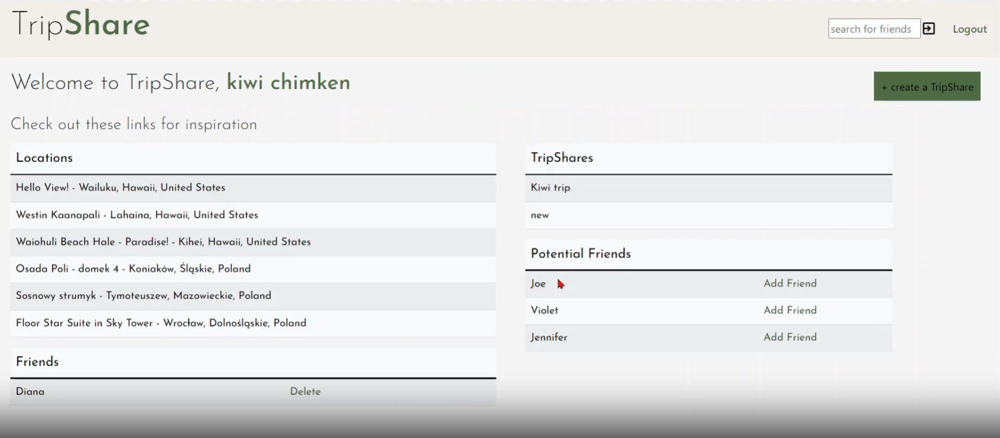
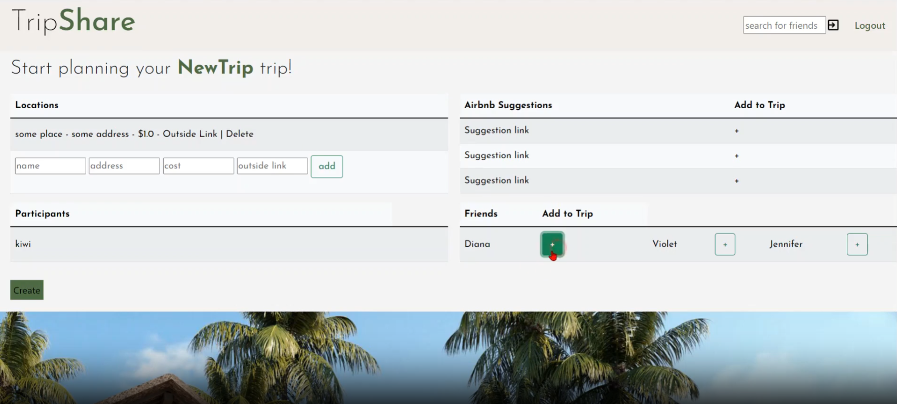
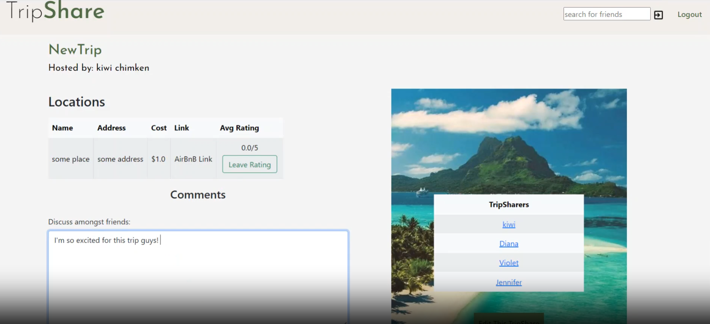

<h1>Trip Share</h1>

 Does it ever feel impossible to make plans for a group? Did you ever think to yourself "It sure would be nice to have an application to help get schedules, ideas, and budgets all in one easy to use app"? Well look no further!

 

 

 Login in to easily store and share your trips, access the info from anywhere. Post trip ideas, build itineraries, and decide on budgets with ease. Rate trips, share ideas, and get more from your vacations!

 

<!-- ABOUT THE PROJECT -->
## About The Project
This project was built in the span of 4 days with a group of fellow students, we approached it as a mock dev jam and really pushed our limits. We built this application in order to more easily plan group trips or reunions after graduation. The app is fully functional and easily implemented.

### Prerequisites
Must have Spring Tools installed

### Installation
1. Import as a spring boot application.
2. Run as Spring Boot App

(<a href="#readme-top">back to top</a>)

<!-- USAGE EXAMPLES -->
## Usage
Use this app to plan your next group trip!

(<a href="#readme-top">back to top</a>)

<!-- MARKDOWN LINKS & IMAGES -->
<!-- https://www.markdownguide.org/basic-syntax/#reference-style-links -->
